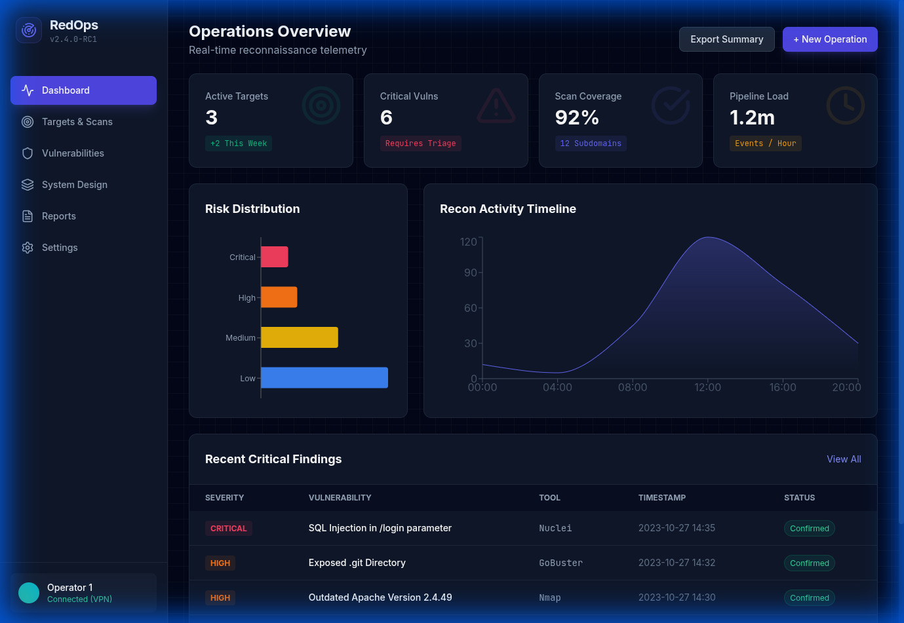

# ReconGo: RedOps Advanced Recon Framework



## Overview
**ReconGo (RedOps)** is a high-performance reconnaissance framework designed for professional security researchers and red teamers. Built with React, Vite, and Tailwind CSS, it provides a centralized dashboard for managing targets, visualizing network architecture, and tracking vulnerabilities.

## Key Features
- **Real-time Scan Monitoring**: Integrated terminal for live feedback from reconnaissance tools.
- **Dynamic Dashboard**: Visual representation of reconnaissance data and vulnerability metrics.
- **Target Management**: Comprehensive tracking of targets and discovered subdomains.
- **Architecture Visualization**: Map out network structures and infrastructure relationships.
- **Automated Reporting**: Generate professional reconnaissance reports effortlessly.

## Technology Stack
- **Frontend**: React 19, Vite, Tailwind CSS
- **Icons**: Lucide React
- **Charts**: Recharts
- **AI Integration**: Google Generative AI (@google/genai)

## Getting Started

### Prerequisites
- Node.js (Latest stable version)
- NPM or Yarn

### Installation
1. Clone the repository:
   ```bash
   git clone git@github.com:carbon-evolution/ReconGo.git
   cd ReconGo
   ```
2. Install dependencies:
   ```bash
   npm install
   ```
3. Set up environment variables:
   Create a `.env.local` file and add your Gemini API key:
   ```env
   GEMINI_API_KEY=your_api_key_here
   ```

### Running Locally
To start the development server:
```bash
npm run dev
```
The application will be available at `http://localhost:5173`.

## Customization
The framework is designed to be modular. You can add new scan types or integrate additional tools by modifying the `App.tsx` logic and extending the `pages/` components.

## License
MIT License - See the [LICENSE](LICENSE) file for details.
